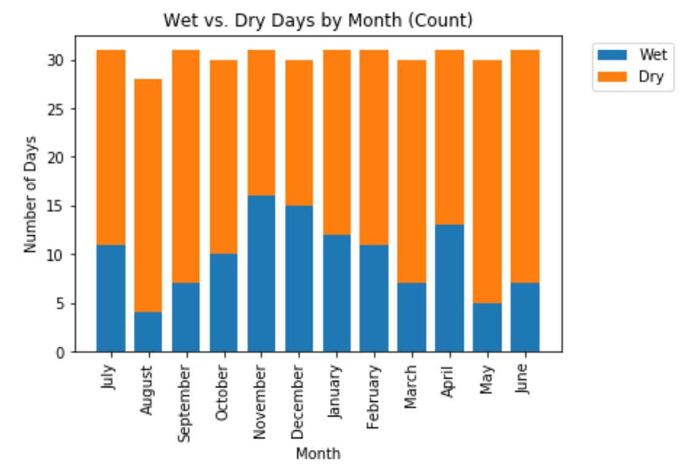
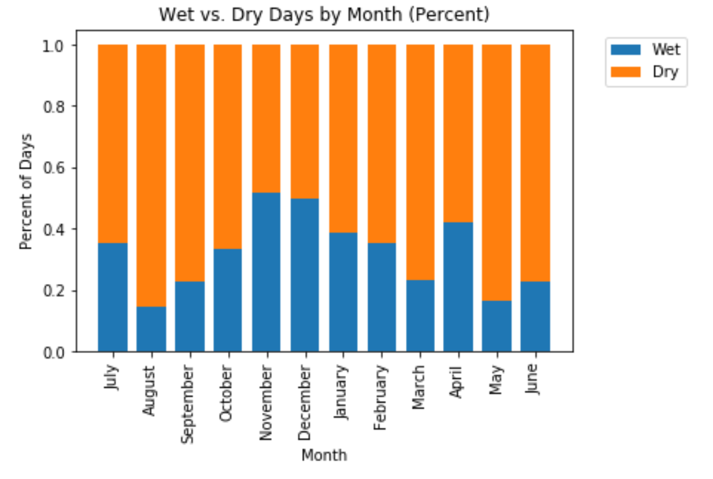
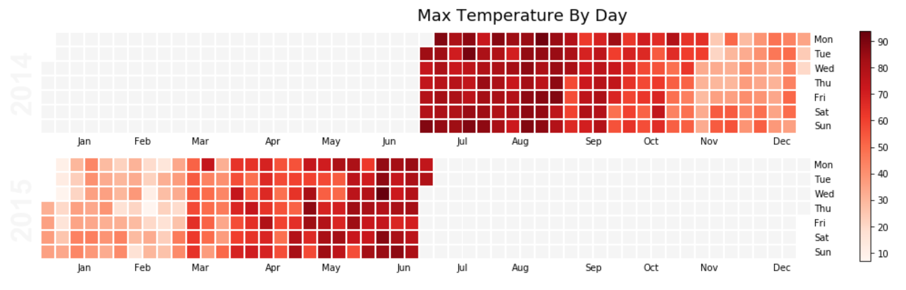
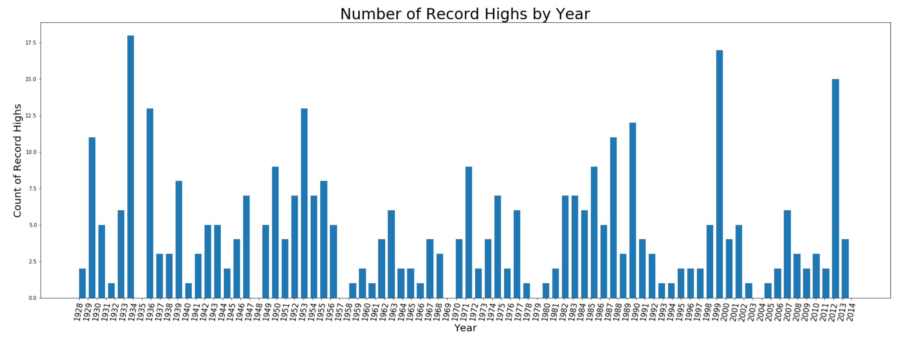
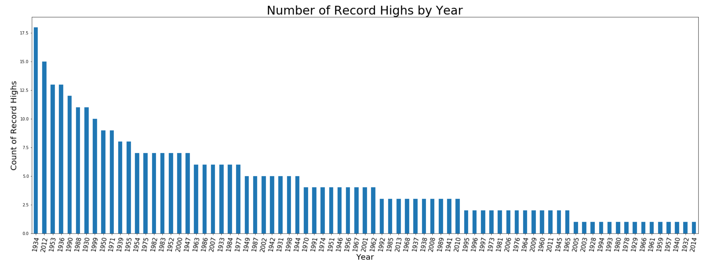

# The Data
I have chosen to explore the weather data for the Chicago airport. This dataset includes information from July 2014 to June 2015, with the following columns:

Column | Description
---|---------
`date` | The date of the weather record, formatted YYYY-M-D
`actual_mean_temp` | The measured average temperature for that day
`actual_min_temp` | The measured minimum temperature for that day
`actual_max_temp` | The measured maximum temperature for that day
`average_min_temp` | The average minimum temperature on that day since 1880
`average_max_temp` | The average maximum temperature on that day since 1880
`record_min_temp` | The lowest ever temperature on that day since 1880
`record_max_temp` | The highest ever temperature on that day since 1880
`record_min_temp_year` | The year that the lowest ever temperature occurred
`record_max_temp_year` | The year that the highest ever temperature occurred
`actual_precipitation` | The measured amount of rain or snow for that day
`average_precipitation` | The average amount of rain or snow on that day since 1880
`record_precipitation` | The highest amount of rain or snow on that day since 1880

Source: [Weather Underground](http://wunderground.com)

### Plots 1 and 2: Precipitation by Month
Plot 1 graphs days with precipitation by month. 

Plot 2 graphs percentage of days with precipitation by month. 

### Plot 3: Heatmap of Maximum Daily Temperature 
This plot visualizes the change in maximum daily temperature over the year, with darker red representing hotter days. Note that there are two plots that are half full. This is because we only have data for half of year for two years.  

### Plots 4 and 5: Record High Temperature by Year
The height of the bars represent the number of record high temperature days in a given year. Plot 4 is sorted by year.

Plot 5 is sorted by number of days with record highs. 
